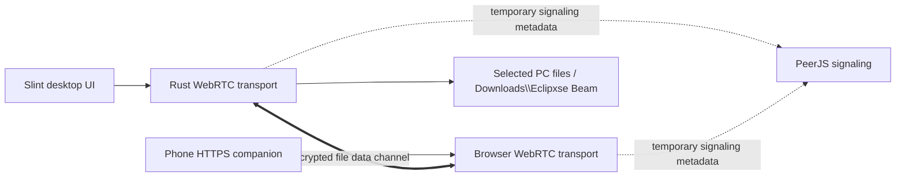

<div align="center">
  
  <h1>Eclipxse Beam</h1>
  <p><strong>Move files. Leave nothing behind.</strong></p>
  <p>A warm, private file-transfer experience for the browser and Windows.</p>

  [](https://github.com/Eclipxse/Eclipxse_beam/actions/workflows/ci.yml)
  [](https://github.com/Eclipxse/Eclipxse_beam/actions/workflows/native-release.yml)
  [](https://github.com/Eclipxse/Eclipxse_beam/actions/workflows/deploy.yml)
  [](LICENSE)

  [Download for Windows](https://github.com/Eclipxse/Eclipxse_beam/releases/latest/download/Eclipxse-Beam-Native-Windows-x64.exe)
  · [Open the web app](https://eclipxse.github.io/Eclipxse_beam/)
  · [Release notes](CHANGELOG.md)
</div>

---

## Meet Eclipxse Beam

Beam is an open-source file-transfer project with a native Windows interface and a browser companion that share one encrypted transport:

| Edition | Best for | Transport | Install required |
| --- | --- | --- | --- |
| **Native Windows** | Premium Windows-to-phone transfers | Encrypted WebRTC with PeerJS signaling | One portable EXE |
| **Web app** | Browser transfers and the native phone companion | Encrypted WebRTC with PeerJS signaling | No |

Neither edition requires an account or uploads your files to Beam-owned cloud storage.

> [!IMPORTANT]
> Native v0.1.1 restores the proven WebRTC transport behind the Slint interface. The QR opens the official HTTPS companion instead of a private LAN address, so router client isolation no longer prevents pairing.

## Native Windows preview

### Select real files


The Send workspace opens the native Windows file picker, displays the real queue, calculates its total size, and exposes only those selected files to the current session.

### Pair your phone


Every launch creates a fresh PeerJS identity and HTTPS QR link. Scan it with the phone camera; the companion connects automatically over encrypted WebRTC.

### Follow every transfer


Phone presence, transfer direction, byte progress, completion, and errors are pushed into the native Slint interface. Incoming files are written directly to disk rather than held entirely in memory.

## Download the native app

Download the latest portable executable:

**[Eclipxse Beam Native for Windows x64](https://github.com/Eclipxse/Eclipxse_beam/releases/latest/download/Eclipxse-Beam-Native-Windows-x64.exe)**

The matching SHA-256 checksum is published beside the EXE on the [Releases page](https://github.com/Eclipxse/Eclipxse_beam/releases).

### Windows requirements

- Windows 10 or Windows 11, 64-bit
- Internet access on both devices for HTTPS signaling
- No shared Wi-Fi, inbound firewall rule, or router configuration required
- No Node.js, Rust, account, or installer required for the downloaded EXE

The current community build is not code-signed. Windows SmartScreen may display an **Unknown publisher** warning. Verify the checksum from the release before running it.

## Use the native app

### Send files from the PC to a phone

1. Start `Eclipxse-Beam-Native-Windows-x64.exe`.
2. Select **Choose files from this computer**.
3. Pick one or more files in the native Windows dialog.
4. Open **Receive** or select **Pair phone**.
5. Scan the generated QR code with the phone camera.
6. Wait for the encrypted connection, then select **Beam selected files**.
7. Download the completed file from the phone activity list.

### Send files from a phone to the PC

1. Open **Receive** in the Windows app.
2. Scan the QR code from the phone.
3. Select **Choose files to beam** on the companion page.
4. Choose files from the phone.
5. Beam saves completed uploads under:

```text
Downloads\Eclipxse Beam
```

Existing names are preserved safely. If a file already exists, Beam creates a collision-safe name such as `photo (1).jpg`.

## Native features

- Native frameless Windows shell built with Slint and Rust
- Warm Raycast-inspired cream, sage, caramel, and espresso design system
- Real Windows file picker and model-backed multi-file queue
- Fresh, unguessable PeerJS identity and HTTPS QR link on every launch
- Official mobile companion hosted on GitHub Pages
- Encrypted PC-to-phone WebRTC transfers
- Encrypted phone-to-PC WebRTC transfers written directly to disk
- STUN discovery with TURN fallback for restrictive routers
- Live device presence with automatic disconnect expiry
- Direction, byte progress, completion, and error states
- Automatic transfer-workspace navigation when an upload begins
- Filename sanitization and collision-safe download paths
- 8 GiB per-file upload guard
- Deterministic screenshot mode for visual regression checks

## Web edition

The browser edition remains available at **[eclipxse.github.io/Eclipxse_beam](https://eclipxse.github.io/Eclipxse_beam/)**.

Its workflow is:

1. The receiving browser opens Beam and receives a temporary PeerJS identifier.
2. The sender scans the QR code or opens its pairing link.
3. PeerJS exchanges signaling metadata.
4. File chunks travel over the encrypted WebRTC data channel.
5. The receiver rebuilds the file locally and downloads it from the browser.

The default signaling service can observe connection metadata, but Beam does not intentionally send file payloads through it.

## Architecture

### Native v0.1.1



PeerJS coordinates the offer, answer, and network candidates. File payloads use the encrypted WebRTC data channel. Incoming names are sanitized before a collision-safe destination is created, and phone uploads are streamed to disk rather than retained in memory.

### Web edition

```text
Sender browser ── signaling metadata ── PeerJS signaling service
       │                                      │
       └────── encrypted WebRTC data channel ─┘ Receiver browser
                         file payload
```

## Security and privacy

### Native edition

- Access requires the full random pairing identity embedded in the HTTPS QR link.
- The identity changes whenever the app restarts.
- File payloads travel over WebRTC's encrypted transport.
- PeerJS signaling infrastructure may observe connection metadata but does not receive file payloads.
- TURN may relay encrypted WebRTC packets when a direct path is unavailable.
- Incoming names are stripped of paths, unsafe Windows characters, and reserved device names.
- Close Beam after the transfer to terminate the session immediately.
- Treat every received file as untrusted input and scan it when appropriate.

### Web edition

- File payloads travel through WebRTC's encrypted transport.
- PeerJS signaling infrastructure may observe connection metadata.
- Anyone with a valid temporary pairing link may attempt to connect.
- Received files are untrusted input.

Report vulnerabilities through GitHub's [private vulnerability reporting](https://github.com/Eclipxse/Eclipxse_beam/security/advisories/new), not a public issue. Read the complete [security policy](SECURITY.md).

## Troubleshooting

### The phone cannot open the QR page

- Confirm both devices have internet access.
- Restart Beam to generate a fresh HTTPS pairing link.
- Update to native v0.1.1 or later; v0.1.0 used a same-Wi-Fi HTTP address that restrictive routers could block.
- Temporarily disable browser content blockers if the PeerJS connection is prevented from opening.

### Windows shows “Unknown publisher”

The release is not code-signed yet. Download only from this repository and compare the EXE's SHA-256 hash with `SHA256SUMS.txt` on the release.

### A received filename changed

Beam removes unsafe path characters and Windows reserved names. It also adds `(1)`, `(2)`, and so on when a file already exists.

## Build from source

### Native Windows app

Requirements:

- Stable Rust toolchain
- Windows 10 or 11

```powershell
git clone https://github.com/Eclipxse/Eclipxse_beam.git
cd Eclipxse_beam
cargo run --manifest-path beam-native/Cargo.toml
```

Create the optimized EXE:

```powershell
cargo build --release --manifest-path beam-native/Cargo.toml
```

Output:

```text
beam-native\target\release\eclipxse-beam-native.exe
```

### Web app

Requirements: Node.js 24+ and npm 11+.

```bash
npm ci
npm run dev
```

## Validate changes

```powershell
cargo fmt --manifest-path beam-native/Cargo.toml --all -- --check
cargo test --manifest-path beam-native/Cargo.toml
cargo clippy --manifest-path beam-native/Cargo.toml --all-targets -- -D warnings
npm run check
node scripts/verify-webrtc.mjs
```

The native tests cover the local fallback and transfer state. `scripts/verify-webrtc.mjs` additionally launches the Slint app and browser companion, establishes a live PeerJS/WebRTC session, sends a generated phone fixture, and verifies the saved bytes.

## Repository structure

```text
beam-native/
  src/backend.rs       Native pairing and streaming backend
  src/companion.html   Responsive phone companion
  src/main.rs          Slint/backend bridge and Windows shell
  src/webrtc_transport.rs  PeerJS signaling and encrypted data channels
  ui/                  Slint screens, components, tokens, and assets
desktop/               Electron wrapper for the web edition
src/                   React/PeerJS web application
scripts/               Live WebRTC integration verification
.github/workflows/     CI, Pages, Electron, and native release automation
```

## Current limitations

- The native build is currently Windows x64 only.
- The native app does not yet support folders, resumable transfers, or code signing.
- The web receiver currently assembles received files in memory.
- WebRTC pairing requires temporary access to the public PeerJS signaling and ICE services.

## Roadmap

- [x] Internet-capable native WebRTC transport
- [x] HTTPS phone companion and encrypted WebRTC payload transport
- [ ] Signed Windows installer and automatic updates
- [ ] Folder transfers
- [ ] Pause, resume, retry, and receiver acknowledgements
- [ ] Transfer acceptance prompts and trusted-device history
- [ ] macOS and Linux native builds
- [ ] Internationalization and accessibility review

## Contributing

Contributions are welcome. Read [CONTRIBUTING.md](CONTRIBUTING.md), keep pull requests focused, include tests, and attach screenshots for visible changes.

## License

Eclipxse Beam is released under the [MIT License](LICENSE).

<div align="center">
  <sub>Designed and built with moonlight by Eclipxse 🌙⚡</sub>
</div>
