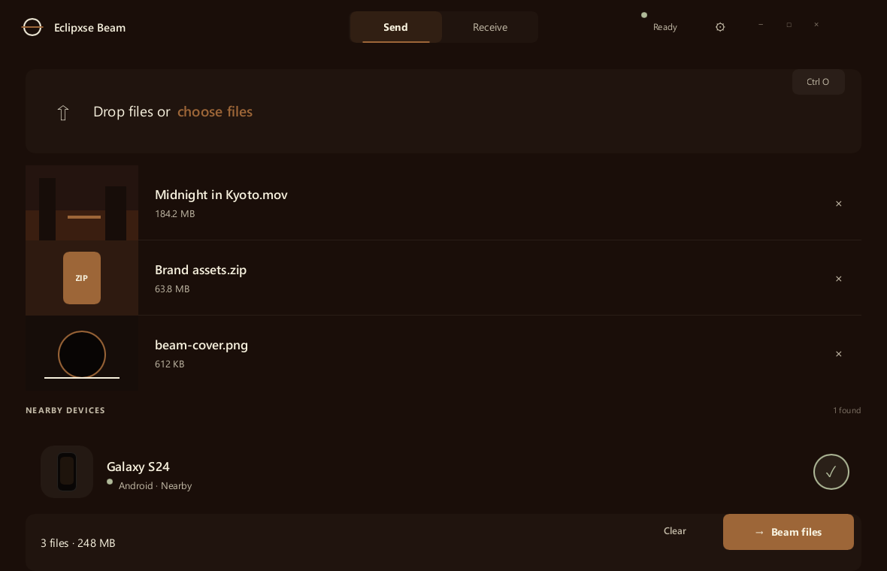
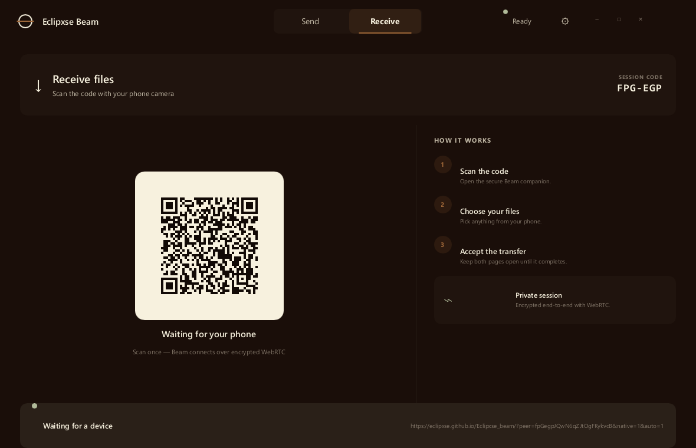
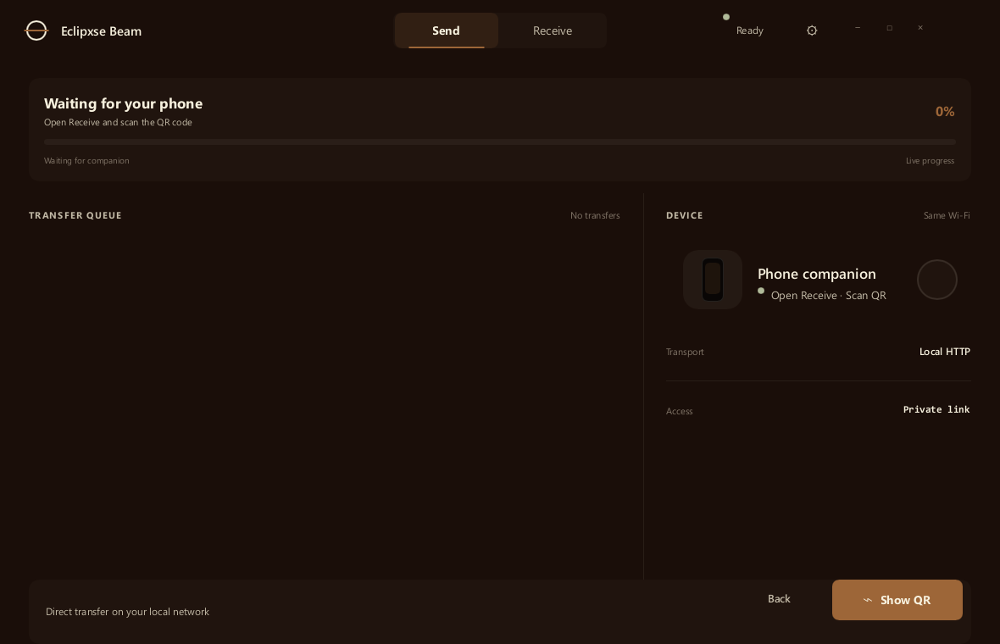

# Eclipxse Beam Native

This folder contains the premium Slint + Rust desktop edition of **Eclipxse Beam**.

The native app combines the borderless, Raycast-inspired interface with encrypted WebRTC transfers. Scanning its QR code opens the HTTPS Beam companion, PeerJS exchanges temporary signaling metadata, and the file payload travels over a WebRTC data channel. The earlier same-Wi-Fi HTTP companion remains in the backend as a development fallback.

## Preview

| Send | Receive | Active transfer |
| --- | --- | --- |
|  |  |  |

## Run it

Install the stable Rust toolchain and Node.js 24+, then run from the repository root:

```bash
npm run native:dev
```

Open a specific interface state:

```bash
cargo run --manifest-path beam-native/Cargo.toml -- --screen receive
cargo run --manifest-path beam-native/Cargo.toml -- --screen transfer
```

## Current scope

- Native frameless Windows shell with working minimize, maximize, close, and drag controls
- Warm-earth design tokens and reusable, borderless Slint components
- Native Windows file picker and a real, model-backed file queue
- Fresh, unguessable PeerJS identity and HTTPS QR link on every launch
- Encrypted WebRTC data channels with STUN and TURN connectivity fallback
- Phone-to-PC files saved under `Downloads/Eclipxse Beam`
- PC-to-phone transfers exposed as browser downloads
- Live device, direction, completion, and byte-progress updates in Slint
- Filename sanitization, collision-safe saves, and an 8 GiB per-file limit
- Token-protected local HTTP companion retained for development and fallback testing
- Deterministic screenshot mode for visual regression review

The approved visual direction is preserved in [`docs/raycast-warm-borderless.png`](docs/raycast-warm-borderless.png).

## Phone pairing

1. Open **Receive** in the native app.
2. Scan the QR code with the phone camera. The phone opens the official HTTPS Beam companion.
3. The companion connects automatically over encrypted WebRTC.
4. Choose files on either device and keep both apps open until the transfer reaches **Done**.

The devices can be on the same Wi-Fi or on different networks as long as both can reach the internet. File payloads do not pass through the PeerJS signaling service; TURN may relay the encrypted WebRTC traffic only when a direct route cannot be established.

## Visual capture

Set `ECLIPXSE_CAPTURE` to save a rendered PNG and close the app automatically:

```powershell
$env:ECLIPXSE_CAPTURE = "beam-native/captures/send.png"
cargo run --manifest-path beam-native/Cargo.toml -- --screen send
```

## Validation

```powershell
cargo fmt --manifest-path beam-native/Cargo.toml --all -- --check
cargo test --manifest-path beam-native/Cargo.toml
cargo clippy --manifest-path beam-native/Cargo.toml --all-targets -- -D warnings
npm run check
node scripts/verify-webrtc.mjs
```

The final command performs a live integration check: it starts the native app, connects the browser companion through PeerJS/WebRTC, sends a generated fixture from the browser, and verifies the saved bytes.
